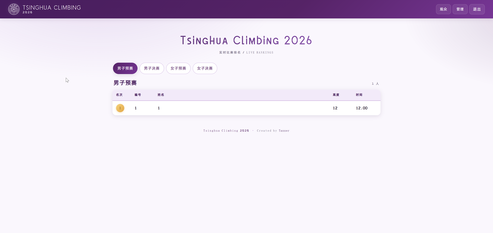
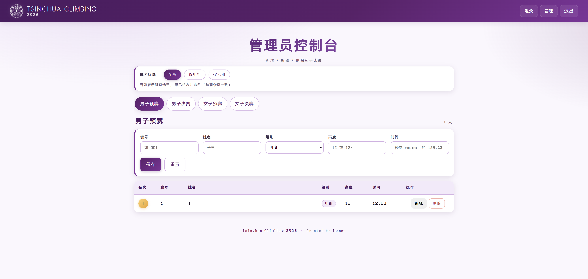

<div align="center">


# Tsinghua Climbing 2026

**清华大学 马约翰杯 攀岩比赛 · 实时排名展示与管理系统**

> 本项目最初用于 **2025-2026 年度清华大学"马约翰杯"学生运动会攀岩比赛**
> （简称"马杯攀岩"）的现场记分与观众席/直播屏幕展示。  
> 若你需要用于其他年度或其他学校的赛事，参见文末
> [如何迁移到 2027 / 其他赛事](#-如何迁移到-2027--其他赛事) 一节。

轻量级 · 自部署 · 手机电脑自适应 · 四个赛道独立排名 · 甲乙组后台筛选 · 每 10 分钟自动备份

[](https://www.python.org/)
[](https://flask.palletsprojects.com/)
[](./LICENSE)

</div>

---

## ✨ 特性

- **四个赛道**：男子预赛 / 男子决赛 / 女子预赛 / 女子决赛，每个赛道独立排名。
- **合规排名规则**：
  1. 高度优先（`12+` 高于 `12`，数字越大越优）
  2. 同高度按时间升序（用时越短越优）
  3. 高度和时间都相同 → 并列同名次
- **两类页面**：
  - **观众页面** `/`：只读、表格大字清晰、每 15 秒自动刷新、金银铜徽章。
  - **管理员页面** `/admin`：增 / 改 / 删选手成绩，可按 **甲组 / 乙组 / 全部** 切换排名。
- **甲乙组**：每位选手可标记为甲组 (A) 或乙组 (B)。管理员一键按组别排名；
  **观众前台不显示任何组别信息**，始终展示总排名。
- **鉴权保护**：首次访问强制初始化管理员；密码 PBKDF2 哈希存储；
  CSRF Token 保护；登录失败限流（同 IP 5 分钟 10 次）；
  Flask `debug` 已关闭，避免调试控制台 RCE。
- **本地备份**：每 10 分钟用 SQLite 在线备份 API 做一致性快照到 `backup/`，
  自动轮转，最多保留 100 份。
- **跨平台**：Windows `start.bat`、Linux / macOS `start.sh`。纯 Python + Flask + SQLite，
  零外部依赖。
- **响应式 UI**：电脑大屏、手机竖屏都能自适应；清华紫主色调；
  中文使用阿里巴巴普惠体，英文 / 数字使用 Death Stranding 风格装饰字体。

---

## 📸 页面示意

### 观众页面

> 四赛道实时排名，每 15 秒自动刷新，前三名金银铜徽章高亮。



### 管理员页面

> 可按 `全部` / `仅甲组` / `仅乙组` 切换排名，支持成绩录入、编辑和删除。



---

## 🚀 快速开始

### 依赖

- Python 3.9 或以上
- 系统自带的 SQLite（无需额外安装）

### Windows

1. 下载或 `git clone` 本仓库。
2. 双击 `start.bat`，脚本会自动创建虚拟环境、安装依赖并启动服务。
3. 在终端中查看"局域网 IP"，在同 Wi-Fi 下的手机 / 其他电脑访问 `http://<IP>:5000`。

### Linux / macOS

```bash
git clone https://github.com/<your-user>/tsinghua-climbing-2026.git
cd tsinghua-climbing-2026
chmod +x start.sh
./start.sh
```

### 手动启动

```bash
python3 -m venv .venv
source .venv/bin/activate          # Windows: .venv\Scripts\activate
pip install -r requirements.txt
python server.py
```

首次访问会自动跳转到 **`/setup`**，在这里**由你设置管理员账号和密码**；
系统不会内置任何默认账号。密码以 PBKDF2 哈希形式保存（无法逆向），
同时会在 `data/credentials.txt` 写入一份**明文备份**，方便你本机找回。

---

## 🔐 管理员使用

登录 `/admin` 后：

| 操作 | 说明 |
|---|---|
| 切换赛道 | 顶部四个大按钮：男子预赛 / 男子决赛 / 女子预赛 / 女子决赛 |
| 筛选排名 | `全部` / `仅甲组` / `仅乙组` —— 仅甲 / 乙组筛选时名次会在该组内部重新计算 |
| 录入选手 | 表单字段：**编号、姓名、组别 (A/B)、高度、时间** |
| 编辑 | 点击每行 "编辑" 按钮，回填到上方表单修改后保存 |
| 删除 | 点击每行 "删除" 按钮，弹窗确认 |

### 输入格式

- **高度**：`12` 或 `12+`（数字 0-999，可选加号；规则上 `整数+` 高于 `整数`）
- **时间**：`秒数` 或 `mm:ss`，例如 `125.43` 或 `2:05.43`

### 唯一性约束

- 同一赛道内，`编号` 必须唯一。
- 不同赛道可以复用同一个编号（因为是同一个选手在不同赛道的成绩）。

---

## 👥 观众使用

- 直接访问 `http://<IP>:5000/`。
- 顶部切换赛道；数据每 15 秒自动刷新（不用手动 F5）。
- 前三名会显示 🥇🥈🥉 样式的彩色徽章。
- **观众看不到组别信息**，只看到合并后的总排名。

---

## 🏆 排名规则

同一赛道内：

```
排序键: (高度数值 ↓, 带+ ↓, 时间 ↑, id ↑)
```

| 高度 | 对应排序 |
|---|---|
| `13`   | (13, 0) |
| `13+`  | (13, 1) —— 比 `13` 高 |
| `14`   | (14, 0) —— 比 `13+` 高 |

示例：

| 编号 | 高度 | 时间 | 名次 |
|---|---|---|---|
| M04 | 14   | 8.00  | **1** |
| M01 | 13   | 10.00 | **2** |
| M05 | 12+  | 10.50 | **3**（并列） |
| M06 | 12+  | 10.50 | **3**（并列） |
| M02 | 12+  | 11.00 | **5** |
| M03 | 12   | 9.00  | **6** |

---

## 💾 数据 / 备份 / 凭据

| 路径 | 说明 |
|---|---|
| `data/climbing.db`     | SQLite 数据库：选手成绩、管理员账号哈希 |
| `data/credentials.txt` | **管理员明文账号密码**（setup 时写入，本机查阅找回用） |
| `data/secret.key`      | Session 签名密钥（首次启动自动生成） |
| `backup/`              | 每 10 分钟一次的数据库快照，命名 `climbing-YYYY-MM-DD_HH-MM-SS.db`，最多保留 100 份 |

**重要提醒**：`data/` 和 `backup/` 已被加入 `.gitignore`，**不会被提交到仓库**。
特别是 `credentials.txt` 包含明文密码，**请勿分享或同步到云端**。

### 恢复某个备份

```bash
# 1) 停止服务 (Ctrl + C 或关闭窗口)
# 2) 用备份覆盖当前数据库
cp backup/climbing-2026-05-01_10-30-00.db data/climbing.db
# 3) 重新启动
./start.sh    # 或 start.bat
```

### 调整备份频率 / 份数

修改 `server.py` 顶部两个常量：

```python
BACKUP_INTERVAL_SEC = 600   # 秒, 600 = 10 分钟
BACKUP_KEEP         = 100   # 最多保留份数
```

---

## 🌐 网络与防火墙

- 默认监听 `0.0.0.0:5000`，同局域网设备可通过本机 IP 访问。
- Windows 首次启动可能弹防火墙提示，**勾选"专用网络"** 即可。
- 若提示 *"套接字访问权限不允许"*，可改为只监听本机：
  - 临时：`set TSINGHUA_CLIMBING_HOST=127.0.0.1`（Windows）或
    `export TSINGHUA_CLIMBING_HOST=127.0.0.1`（Linux/Mac）
  - 或修改 `server.py` 顶部的 `HOST` / `PORT` 默认值。
- **不建议**将此服务直接暴露到公网；它是按内网比赛场景设计的，
  没有 HTTPS / 反向代理 / WAF 等公网加固。如需公网访问，
  请自行套一层 Nginx + Let's Encrypt + IP 白名单 / Cloudflare 等。

---

## 🛡 安全说明

- 密码只以 `werkzeug.security.generate_password_hash` 的 **PBKDF2** 哈希存储，
  服务器端无法反查明文。
- 所有写操作（录入 / 编辑 / 删除 / 登录 / 登出 / 初始化）都有 **CSRF Token** 校验。
- Session Cookie：`HttpOnly` + `SameSite=Lax`，签名密钥在本地 `data/secret.key` 随机生成。
- 登录失败限流：同一 IP 在 5 分钟内累计 10 次失败后拒绝 5 分钟。
- Flask `debug=False`, `use_reloader=False`，避免 Werkzeug 调试控制台的 RCE 风险。
- 所有 SQL 均为**参数化查询**，无拼接。
- 请求体最大 1 MB（`MAX_CONTENT_LENGTH`）。

---

## 🗂 项目结构

```
tsinghua-climbing-2026/
├── server.py              # Flask 后端：路由、鉴权、排名、备份
├── requirements.txt       # Python 依赖 (Flask + Werkzeug)
├── start.bat              # Windows 一键启动
├── start.sh               # Linux / macOS 一键启动
├── README.md              # 本文件
├── LICENSE                # MIT License (仅覆盖源代码)
├── NOTICE.md              # 第三方资源 (字体/校徽) 的版权声明
├── .gitignore
├── static/
│   ├── css/style.css      # 紫色主题 + 响应式样式
│   ├── fonts/             # 阿里巴巴普惠体 + Death Stranding 粉丝字体
│   │   └── README.md      # 字体来源和授权说明
│   ├── img/logo.png       # 校徽 (见 NOTICE.md)
│   └── js/
└── templates/
    ├── base.html          # 顶栏 / 导航 / 页脚
    ├── viewer.html        # 观众页
    ├── admin.html         # 管理员页
    ├── login.html         # 登录
    ├── setup.html         # 首次初始化
    └── error.html         # 错误页 (400/401/404)
```

---

## 🛠 环境变量

| 变量 | 默认 | 说明 |
|---|---|---|
| `TSINGHUA_CLIMBING_HOST` | `0.0.0.0` | 监听地址 |
| `TSINGHUA_CLIMBING_PORT` | `5000`    | 监听端口 |

---

## 🔄 如何迁移到 2027 / 其他赛事

本项目最初用于 **2025-2026 年度清华大学"马约翰杯"攀岩比赛**。
如果明年（2026-2027 年度）、或其他学校/其他赛事想直接复用，
只需修改下面 3-5 个地方即可。

### 1. 更换标题和年份（必改）

所有显示给用户的"Tsinghua Climbing 2026"出现在以下位置：

| 文件 | 需要修改的位置 |
|---|---|
| `templates/base.html` | `<title>`、顶栏 `brand-title` / `brand-sub`、页脚 `footer-title` |
| `templates/viewer.html` | `<h1 class="hero-title">Tsinghua Climbing 2026</h1>` |
| `templates/*.html` | 其他页面的 `` |
| `README.md` | 项目标题和介绍段落 |

快速替换命令（在项目根目录执行）：

```powershell
# Windows PowerShell
Get-ChildItem -Recurse -Include *.html,*.md,*.py | ForEach-Object {
    (Get-Content $_.FullName -Raw) -replace 'Tsinghua Climbing 2026','Tsinghua Climbing 2027' |
        Set-Content $_.FullName -Encoding UTF8
}
```

```bash
# Linux / macOS
grep -rl 'Tsinghua Climbing 2026' --include='*.html' --include='*.md' --include='*.py' . | \
    xargs sed -i 's/Tsinghua Climbing 2026/Tsinghua Climbing 2027/g'
```

如果你愿意，可以在 `server.py` 顶部加一个常量把年份抽成变量，
然后在模板里用 `{{ EVENT_TITLE }}` 之类引用，这样以后只改一处即可。

### 2. 是否保留 / 更换校徽（必看）

- 如果你仍然是 **清华大学校内赛事**，可以继续使用 `static/img/logo.png` 的清华校徽。
- 如果是**其他学校 / 非清华赛事 / 任何商业场景**，
  **请务必替换 `static/img/logo.png`** 为你自己单位的 logo，
  以避免侵犯清华大学的商标权（详见 [`NOTICE.md`](./NOTICE.md)）。

替换方式：直接覆盖 `static/img/logo.png`（建议 正方形、不小于 256×256、PNG 透明背景）。

### 3. 清空上一届数据

旧的一届比赛数据都在 `data/` 和 `backup/`。最干净的迁移方式是
**把整个仓库 `git clone` 一份到新目录，作为 2027 届的运行时**：

```bash
# 假设你已把本项目推到自己的 github:
git clone https://github.com/<you>/tsinghua-climbing-2026.git tsinghua-climbing-2027
cd tsinghua-climbing-2027
# 按上面 1/2 步修改标题和 logo
# 首次启动时会自动初始化空数据库, 让你设置新的管理员账号
./start.sh        # 或 start.bat
```

如果你就在原目录继续用，也可以直接删掉 `data/` 和 `backup/`
（记得先把上一届 `climbing.db` 另外归档保存）：

```bash
# 停止服务后
mv data  archive/2026-data
mv backup archive/2026-backup
mkdir data backup
./start.sh
```

### 4. （可选）调整赛道名称

如果明年比赛项目有增减（比如改成 "男子预赛 / 男子半决赛 / 男子决赛 / 女子..."
共 6 个赛道），修改 `server.py` 顶部的 `TRACKS` 字典即可：

```python
TRACKS = {
    "men_qual":   "男子预赛",
    "men_semi":   "男子半决赛",   # ← 新增
    "men_final":  "男子决赛",
    "women_qual": "女子预赛",
    "women_semi": "女子半决赛",   # ← 新增
    "women_final":"女子决赛",
}
```

数据库有 `UNIQUE(track, number)` 约束自动处理，不需要迁移脚本。
已有 entries 表中 `track` 字段是自由字符串，保留/新增/重命名都可以。
但若你**删除**一个旧 track 的枚举值而对应的旧数据还在表里，
会导致这些数据不再显示（数据本身仍在 DB 中）；如要清理可
`DELETE FROM entries WHERE track='men_qual_old';`。

### 5. （可选）调整甲乙组命名

如果比赛没有甲乙组区分，可以在管理页面全部录为"甲组"就好，
观众页本来就不显示组别信息，不会有任何副作用。

如果想把 A/B 改为 C/D 或其他标签，修改 `server.py` 的 `GROUPS` 字典：

```python
GROUPS = {
    "A": "甲组",   # 改成你想要的显示名
    "B": "乙组",
}
```

**不要改 `A` / `B` 这两个键**，它们是存在数据库里的枚举值，
直接改键名会和已有数据冲突。需要改键名时请用一次性 SQL 迁移：

```sql
UPDATE entries SET group_name = 'C' WHERE group_name = 'A';
UPDATE entries SET group_name = 'D' WHERE group_name = 'B';
```

---

## 🙏 鸣谢 / Acknowledgements

本项目使用了以下第三方资源，特此致谢——**详细版权条款见 [NOTICE.md](./NOTICE.md)**：

- **[阿里巴巴普惠体 3.0](https://www.alibabafonts.com/#/font)** —— 免费商用中文字体，
  覆盖本项目所有中文字符显示。
- **Death Stranding 风格字体（粉丝作品）** —— 用于英文标题 / 数字 / 装饰文本。
  来源：<https://www.reddit.com/r/DeathStranding/comments/13r3lik/death_stranding_custom_made_fonts/?tl=zh-hans>
  <br>
  这是 Reddit 社区粉丝根据游戏内字体观察重制的作品，属**非官方同人创作**，
  **仅限非商业使用**。Death Stranding 及其游戏内原始字体版权归
  Kojima Productions 所有。
- **清华大学校徽** —— 本仓库作为清华大学校内攀岩赛事记分展示使用。
  清华大学校徽为清华大学的注册商标。如你 fork 本项目用于其他场景，
  **请替换 `static/img/logo.png` 为你自己的 logo**。

---

## 📄 License

本项目**源代码**采用 [MIT License](./LICENSE) 开源，作者：**Tanner**。

仓库中附带的第三方字体、图像资源 **不适用 MIT License**，
请按各自的版权条款使用，详见 [NOTICE.md](./NOTICE.md)。

---

<div align="center">

Made with ❤️ for Tsinghua Climbing 2026 — **Created by Tanner**

</div>
